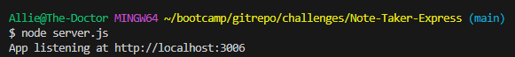
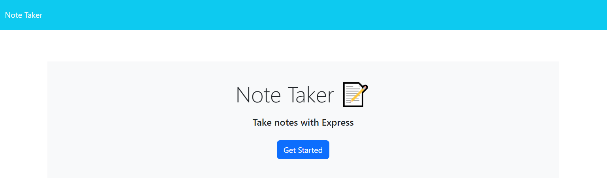
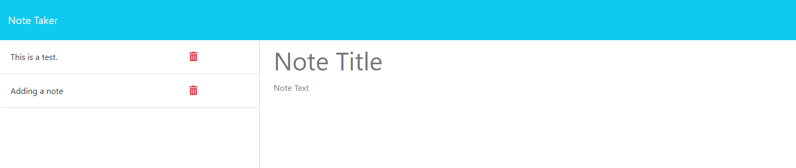
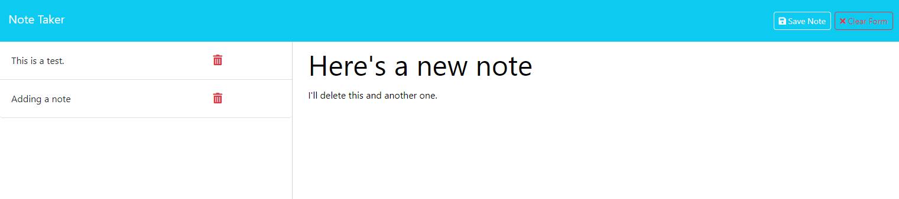
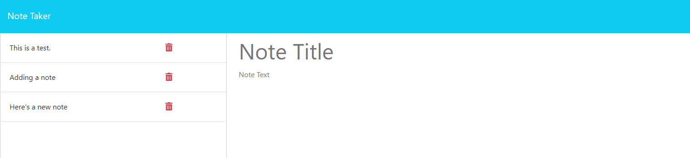
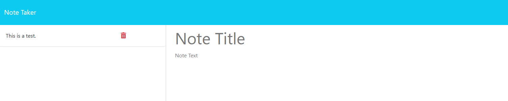
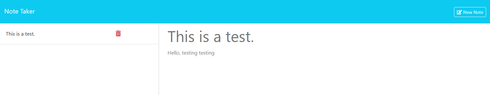

# Note-Taker-Express

## Badge
[]
 

## Table of Contents
- [Description](#description)
- [Screenshots](#screenshots)
- [Usage](#usage)
- [What I Have Learned](#what-i-have-learned)
- [Credits](#credits)
- [Licenses](#licenses)
 

## Description
Challenge 11 coursework for UT bootcamp. Uses Heroku and Express.js.  
This is a note-taker application, hosted in-browser, and will take  
user input for adding a new note, deleting saved notes, and clearing  
an open note form. Saved notes can also be clicked on to display information.  

## Screenshots
---Launching site via terminal---  
(Will be accessed through Heroku).  

---The Note Taker page---  

---Getting started; Shows the current notes stored in db.json---  

---Writing a new note---  

---Added new note to the side---  

---Deleting two notes---  

---Clicking on the test note---  

## Usage
Simply click on the link and watch the magic happen.    
Link to the website: OFFLINE  

## What I Have Learned
I learned a lot about connecting back-end functionality to the front-end.  
I learned to use a server file to host routes, making route files that connect  
with the .html files, and communicate with the script .js file. Data can be   
saved to a .json file, and edited through the front-end interaction.  

## Credits
Made by Allie Stewart.  
A lot of help found through previous class notes in this module 11, and  
through helpful answers from https://stackoverflow.com  

## Licenses
Please refer to the LICENSE in the repository.  
